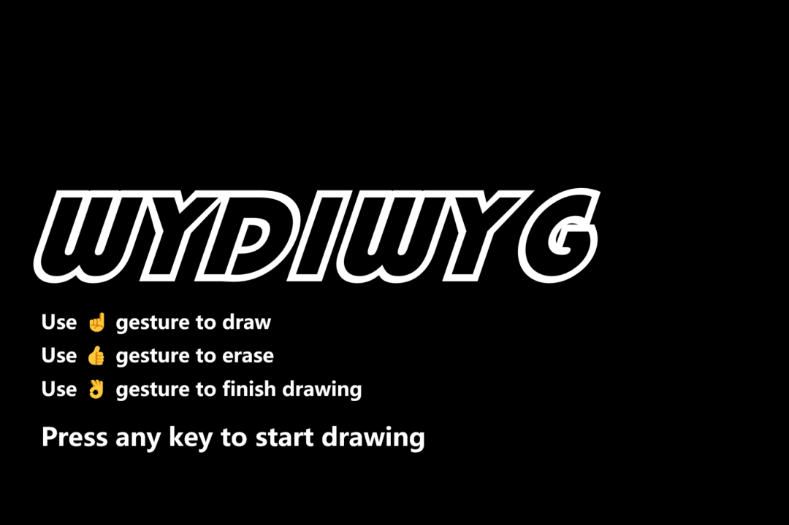

# WYDIWYG



## Introduction

The concept of "What You Draw Is What You Get" (WYDIWYG) is to quickly build creativity by turning your finger into a brush through a simple camera. Generative AI then transforms your sketch into your ideal creation, allowing everyone to effortlessly create a masterpiece!

## Enviornment Requirements

1. Require Python 3.10+
2. Create a virtual environment using `virtualenv`
    ```sh
    virtualenv -p python venv
    ```
3. Install the package (The version may be various depends on your devices)
    ```sh
    source venv/bin/activate
    pip install -r requirements.txt
    ```

## Usage Guide

1. **Start the Application**
    - Run the main script to start the application.
        ```sh
        python main.py
        ```

2. **Drawing**
    - A window will open with the camera feed.
    - Use your finger to draw in the air. The application will detect your hand and allow you to draw on the screen.
    - Use the following gestures:
        - **☝️ Draw**: Extend your index finger to draw.
        - **👍 Erase**: Extend your thumb to erase.
        - **👌 Finish**: Make an "OK" gesture to finish the sketch.

3. **Generating Painting**
    - After finishing the sketch, the application will process the sketch and generate a painting using generative AI.
    - The painting will be displayed in the same window.

4. **Saving Results**
    - The generated sketches and paintings are automatically saved in the `results/` directory with a timestamp.

5. **Functional Keys**
    - Press `q` to quit the application at any time.
    - Press `s` to save the current sketch and generate a painting.
    - Press `r` to reset the canvas and start a new sketch.

## Project Structure

The project consists of the following main files and directories:

```plaintext
WYDIWYG/
├── main.py
├── draw.py
├── paint.py
├── images/
├── models/
└── results/
```

- `main.py`: The entry point of the application. It initializes the drawing and painting processes.
- `draw.py`: Contains the `FingerDrawer` class, which handles the drawing logic using hand landmarks.
- `paint.py`: Contains the `SmartPainter` class, which transforms the sketch into a painting using generative AI.
- `images/`: Contains image assets used in the project.
- `models/`: Contains  pre-trained model files used for AI inference.
- `results/`: Directory where the generated sketches and paintings are saved.
